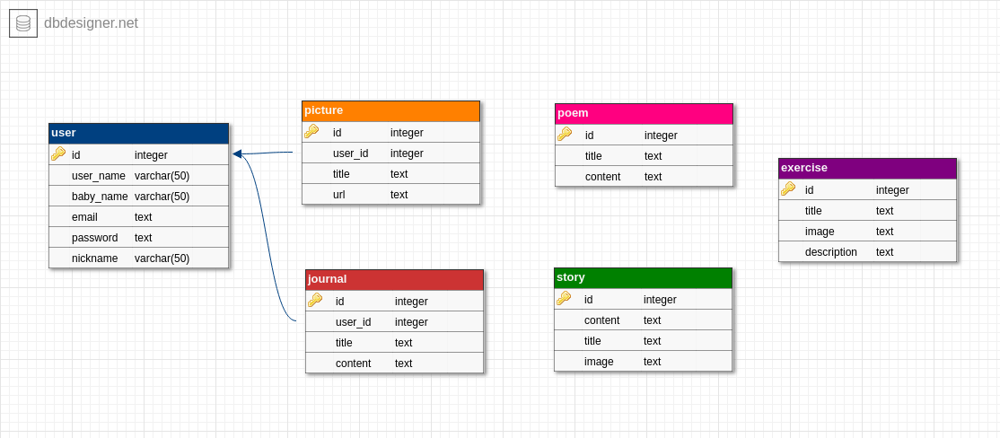

# Documentation for Nova App for Developers

### All User Stories/Backlog Items
- As a user, I want to see a disclaimer before I proceed to navigate the page. 
- As a user, I want to know what Nova is about.
- As a user, I want to create a new account in Nova app.
- As a user, I want to login to my account.
- As a user, I want to navigate through the pages easily on my mobile. 
- As a user, I want to feel not alone and like somebody cares by asking me about my feelings/thoughts.
- As a user, I want to know what kind of support Nova provides to make me feel better.
- As a user, I want to find good resources of information and suggestions to help me let go of negative feelings/trauma.
- As a user, I want to have a non-judmental space where I write my diaries during trigger times.
- As a user, I want to view all my diaries.
- As a user, I want all of my diaries to be private.
- As a user, I want to delete any diary that makes me feel bad.
- As a user, I want to edit any diary any time.
- As a user, I want to have a place to save lillies/pictures for my loved ones.
- As a user, I want to delete any picture any time I want.
- As a user, I want to see all the pictures I save in my personal corner.
- As a user, I want to do some exercises when I feel overwhelmed/bereaved.
- As a user, I want to find some distractions, like reading poems.
- As a user, I want to add a poem that helped me/that I love.
- As a user, I want to read the stories of other people who experienced loss of loved ones.
- As a user, I want to be able to share my story when I feel I am ready for that.


### Main Features:
The features we will work on during this sprint are:
1. Information & Suggestions
2. Personal Space
    - Journal
    - Pictures

### Stretch Goals
1. Continue Personal Space:
    - Exercises
    - Poems
2. Other Stories & Share Your Story


### Call Stack:
- **FrontEnd**: Reactjs
- **BackEnd**: Nodejs
- **Server**: Expressjs
- **Database**: PostgreSQL? MongoDB?


### Components:
  #### Pages:
  1. LandingPage
  2. Login
  3. Signup
  4. AboutUs
  5. Status
  6. HomePage
  7. Journals
  8. Journal
  9. EditJournal
  10. NewJournal
  11. Pictures
  12. NewPicture
#### Common Components:
1. Header
2. Footer
3. Loading
4. Menu
5. DropDown
6. Button
7. JournalCard
8. ServiceCard
9. Input
10. TextArea

### Analysis

#### Header
  - Function component
  - props: `{isLogged, className}`<br>
  
  Since we have 4 headers, we need the `className` property to style the component as we want depending on the page.<br>
  `isLogged` property will be passed from the app to this component since it will be needed in the menu to determine what navlinks to display.
  - All props are required

#### Menu
  - Function component
  - props: `{isLogged}`<br>
  
  `isLogged` is needed to determine what navlinks would appear on the menu component. <br>
  Here is an idea of what could be done here:
  ```javascript
  //if logged in
  const navLinksForUsers = [
    {text: 'Nova Home', path: '/home'},
    {text: 'Nova Information', path: '/information'},
    {text: 'Nova Stories', path: '/stories'},
    {text: 'Personal Space', path: '/personal-space'},
    {text: 'Logout', path: '/logout'},
  ]
  //if not logged in
  const navLinksForVisitors = [
    {text: 'Nova Home', path: '/'},
    {text: 'About US', path: '/about-us'},
  ]
  ```
   - Map through one of these arrays to create a list of items(`li` or `button`)
   - `redirectOnClick(path)`:
   When the user clicks on one of these buttons/items, it redirects him to the required page. This could be done using `Redirect` component from `react-dom-router` but I prefer `props.history.push(path)` to maintain our router history. Either way is okay after all!
   - All props are required

#### Button
  - Function component
  - props: `{className, action, text`<br>
  
  className is needed because we have different styles for buttons.
```js
  <Button className='login__button' action={this.submitForm} text='Login'/>
```
  - All props are required

#### Input
   - props: `{label,placeholder,type,action }`<br>
   
   Label and placeholder properties are optional. Other props are required.

  - One style for all inputs :).
  - This component includes label and input elements

```js
  <Input label='Your Email' type='email' placeholder='person@example.com' action={this.validateInput}/>
```
The action function will be called not on each change, rather after blur. So, the event will be `onBlur` to minimize rendering the component as possible. Cool?

#### TextArea
  - Function component
  - props: `{placeholder, action}`

Same thing here, action function will be triggered when `onBlur` event is fired. 
 - All textAreas in the app has the same design.
 - Props are required

#### JournalCard
- Function component
- props: `{id, action}`
- This component inclues the following elements:
  1. h3
  2. p
  3. delete icon (`id` will be passed here)
  4. edit icon (`id` will be passed here)
- `deleteJournal(e)`: when clicking on delete icon
- `redirectOnEdit(e)`: when clicking on edit icon, redirection will happen, using `props.history.push('/edit-journal/:id')`

#### ServiceCard 
  - Function component
  - props: `{icon, title, description, action}`
  - action: when clicking on the card, it redirects to the service page. Use `props.history.push(destination)`

#### DropDown
- This includes a select element with 3 options: stories, information & suggestions, what people said.

- `redirectOnSelect()`: when selecting an option, it redirects to the right page.

### Routes 

**Server Routes:**

| Page | Method | Endpoint | Functionality | Request Body | Response Body|
  | ----- | ---- | ---- | ---- | ----| ----|
  | Signup | POST | `api/v1/signup` | 1.Validation <br> 2.Cryption <br> 3.Database: `insertUser(userName, babyName, nickname, email, password)`<br> 4. `createCookie()` | `{data: {userName, nickname, babyName, email, password}` | `{data: {id},error:undefined}` |
  | Login | POST  | `api/v1/login`  | 1.Database: `selectUser()`<br> 2.Compare Password <br> 3.Create Cookie | `{data: {email, password}}` |`{data:{id}, error:unefined}`  |
  | Journals | GET | `api/v1/journals` | 1. Database: `selectJournals(userId)`| - | `{data:{journals: [{id, title, content}, {id, title, content}]}, error:undefined}` |
  | Journals | DELETE | `api/v1/journals/:id`|1.Database: `deleteJournal(id, userId)`| - | `{data: {id}, error:undefined}` |
 | Journal | PUT | `api/v1/journals/:id`| 1.Validation <br> 2.Database: `updateJournal(id, userId)`| `{data: {title, content}}`| `{data: {id}, error:undefined}` |
  | Journal | GET | `api/v1/journals/:id` |1.Database: `selectJournal(id, userId)` | - |`{data:{id, title, content}, error:undefined}` |
  | Journal |POST | `api/v1/journal/new` |1.Database: `insertJournal(title, content, userId)`|`{data: {title, content}}`| `{data: {id}, error:undefined}`|
 | Pictures | GET | `api/v1/pictures` | 1.Database: `selectPictures(userId)`| - | `{data: {pictures:[{id, imgSrc, title}, {id, imgSrc, title}]}, error:undefined}` |
  | Pictures | POST  | `api/v1/pictures/new` |1.Validate the image size (not over than 500 kb) <br> 2.Database: `insertPicture(title, imgSrc, userId)`| `{files: {imgSrc}}` |`{data: {id}, error:undefined}`|
  | Logout | GET |`api/v1/logout`| 1.`clearCookie()` | - | `{data:{message:'success'}, error:undefined}` |

  ### Client Routes

  ### Database


<br>
  To Edit, [click here]('https://dbdesigner.page.link/LkJEzgpgUMsVZnfy6')


  ### File Structure

